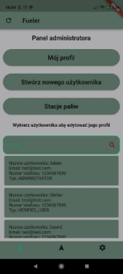
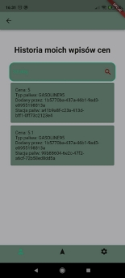

**Efektem realizacji jest aplikacja pod nazwą “Fueler”, pozwalająca użytkownikowi wyszukać aktualne ceny na wybranej stacji paliw, co było celem głównym projektu.** 

**Projekt został stworzony w środowisku Visual Studio Code, po uprzednim przygotowaniu narzędzia tj. instalacja odpowiednich wtyczek pozwalających na korzystanie z języka Dart w oparciu o dokumentację techniczną przygotowaną przez autorów Fluttera.**

**Przed rozpoczęciem prac programistycznych zostały przygotowane szablony ekranów aplikacji na podstawie narzędzie Figma.** 

**Podjęte cele i zrealizowane w tym kierunku prace doprowadziły do stworzenia gotowego rozwiązania.**

*Źródło: Opracowanie własne na podstawie wygenerowanej aplikacji mobilnej “Fueler”* 

Użytkownik po uruchomieniu aplikacji otrzymuje dostępne możliwości interakcji: 

- logowanie 
- rejestracja
- wybór ustawień 
- podgląd mapy

*Źródło: Opracowanie własne na podstawie wygenerowanej aplikacji mobilnej “Fueler”* 

Założenia dotyczące ustawień zakładały wdrożenie dwóch podstawowych opcji: zmiana języka oraz zmiana stylu.

Ilustracje powyżej przedstawiają dostępne opcje przed zmianami i po zmianach.

Działanie jest globalne (działa na wszystkich ekranach), jak i zapisywane w pamięci urządzenia, co powoduje załadowanie wcześniej wybranych ustawień podczas ponownego uruchomienia aplikacji. 

W przypadku określania stylu mapy został stworzony zestaw reguł oddzielnie dla trybu jasnego i ciemnego. Widget mapy korzysta, zależnie od wybranych ustawień, z jednego, bądź drugiego zestawu.

W przypadku jakiegokolwiek wcześniejszego logowania na danym urządzeniu zwracany jest domyślnie ekran logowania, w przeciwnym przypadku domyślnym staje się ekran rejestracji. 

Dostępne typy użytkowników to: 

- administrator
- użytkownik 
- użytkownik zweryfikowany

*Źródło: Opracowanie własne na podstawie wygenerowanej aplikacji mobilnej “Fueler”* 

Wprowadzenie poprawnych danych logowania pozwala na dostęp użytkownikowi do panelu zarządzania profilem, z którego dostępne są funkcjonalności zmiany danych aktualnie zalogowanego użytkownika, usunięcie konta, przeglądanie historii dodanych cen paliw - jeśli takie istnieją oraz wylogowania z urządzenia.

Podczas edycji danych, zwrotnie odbywa się akcja zmiany stylu przycisku, co sygnalizuje na możliwość wykonania akcji aktualizacji.

*Źródło: Opracowanie własne na podstawie wygenerowanej aplikacji mobilnej “Fueler”* 

Wartą uwagi funkcjonalnością wdrożoną do rozwiązania jest stworzenie spersonalizowanego okna dialogowego zwracającego prawdę/fałsz zależnie od wybranej opcji, co pozwala na zwiększenie satysfakcji użytkownika podczas korzystania z narzędzia. Przypadek pokazany na ilustracji odnosi się do zabezpieczenia przypadkowej próby wylogowania z systemu, co po odpowiednim wybraniu opcji dialogowej wykona zamierzoną akcję, lub nie. 

*Źródło: Opracowanie własne na podstawie wygenerowanej aplikacji mobilnej “Fueler”* 

*Źródło: Opracowanie własne na podstawie wygenerowanej wiadomości mailowej, wysłanej na adres zarejestrowanego użytkownika*

W przypadku nowego użytkownika wymagana jest weryfikacja konta, przy wykorzystaniu wysłanej wiadomości na skrzynkę e-mail, podaną podczas rejestracji. 

Ilustracja przedstawia Widget/Ekran, który wykorzystany jest do realizacji procesu weryfikacji, przy prawidłowym wpisaniu ciągu sześciu cyfr zwracany jest komunikat odpowiedni do poprawności wprowadzonych danych. Dodana została dodatkowa opcja pozwalająca na ponowne wysłanie wiadomości e-mail, co pozwoliło na uniknięcie problemu poszukiwania zagubionej wiadomości na skrzynce użytkownika. 

*Źródło: Opracowanie własne na podstawie wygenerowanej aplikacji mobilnej “Fueler”*

Główny cel projektu został zrealizowany w sposób przedstawiony na ilustracjach powyżej.

Użytkownik po wyborze z dolnego menu ikony “mapy” wyzwala wczytanie Widgetu Mapy Google, łącznie z pobraniem obecnej lokalizacji, wszystkich stacji w odległości określanej przez Widget Odległości oraz określeniem ich na mapie. 

Korzystając z górnego menu, należy wybrać opcję “Szukaj”, co przekieruje użytkownika do panelu zarządzania parametrami wyszukiwania, takimi jak:

- długość i szerokość geograficzna - zmienne stałe, z zablokowaną możliwością edycji 
- odległość w kilometrach od obecnej lokalizacji
- typ paliwa
- ilość szacowanych litrów paliwa, które użytkownik planuje zatankować
- przewidywane spalanie pojazdu
- tryb szukania stacji: optymalna stacja/najbliższa stacja/najtańsza stacja według określonej odległości

*Źródło: Opracowanie własne na podstawie wygenerowanej aplikacji mobilnej “Fueler”* 

Poprawne wypełnienie parametrów pozwala na pobranie stacji paliw według preferencji użytkownika, bądź zwrócenie informacji o braku, danego parametrami, miejsca. 

Użytkownik może zapoznać się z lokalizacją stacji, ostatnimi dodanymi typami i cenami paliw, oraz skorzystać z opcji przekierowania wybranego miejsca do innej aplikacji zarządzającej podróżami np. Google Maps, Yanosik, celem wyznaczenia trasy podróży i skorzystania z usług handlowych danej placówki.  

*Źródło: Opracowanie własne na podstawie wygenerowanej aplikacji mobilnej “Fueler”* 

Dodatkowe funkcjonalności dostarczane przez ekran map, to możliwość dodania nowej ceny, jak i zgłoszenie lokalizacji stacji paliw (funkcjonalność niedostępna dla nowego użytkownika, który nie przeszedł procesu weryfikacji). 

Dodanie nowej ceny paliw wymaga zaznaczenia stacji w okolicy lokalizacji urządzenia, określenie typu paliwa, oraz ceny.

Zgłoszenie tyczy się dodania tylko jednej ceny, jednego typu paliwa dla określonej lokalizacji.

Dodanie kolejnej ceny wiąże się z ponownym kliknięciem sekwencję przycisków kierujących do ekranu “Zgłoszenie nowej ceny paliwa”.

Tożsamy mechanizm dotyczy procesu dodawania nowej stacji paliw.

*Źródło: Opracowanie własne na podstawie wygenerowanej aplikacji mobilnej “Fueler”* 

Konto administratora pozwala na takie funkcjonalności jak: 

- zarządzanie użytkownikami
- zarządzanie stacjami paliw
- zarządzanie markami stacji paliw
- zarządzenie własnym profilem

*Źródło: Opracowanie własne na podstawie wygenerowanej aplikacji mobilnej “Fueler”* 

Zarządzanie stacjami, użytkownikami i markami opiera się o aktywności takie jak:

dodawanie nowego obiektu, modyfikacja istniejącego obiektu, usuwanie obiektu, wyszukanie wszystkich obiektów danego typu, wyszukanie konkretnego obiektu po jego identyfikatorze.
